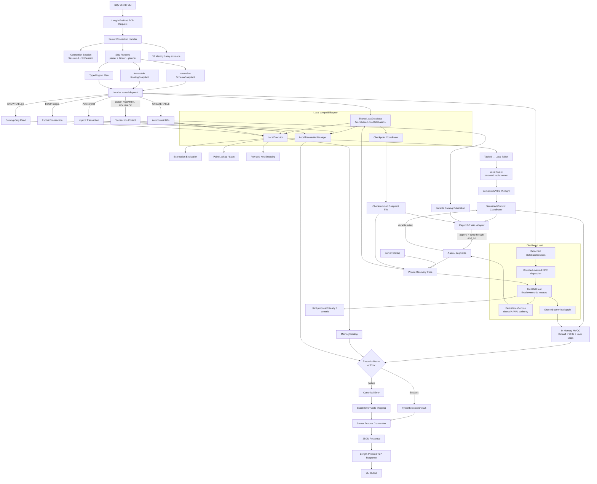
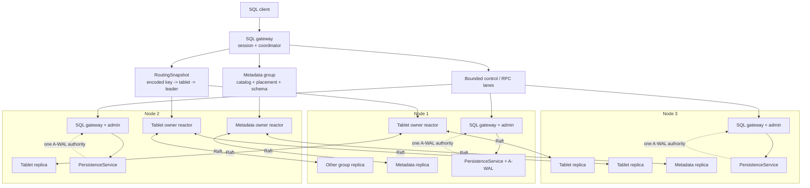
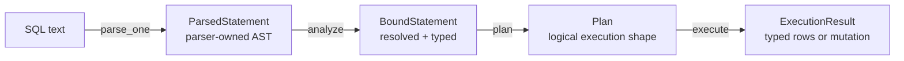
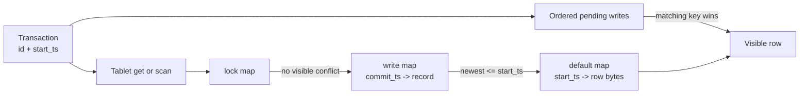
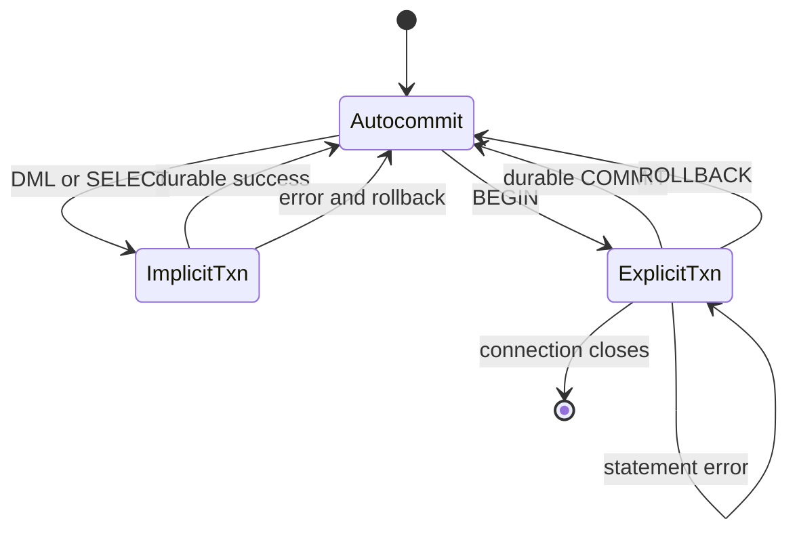
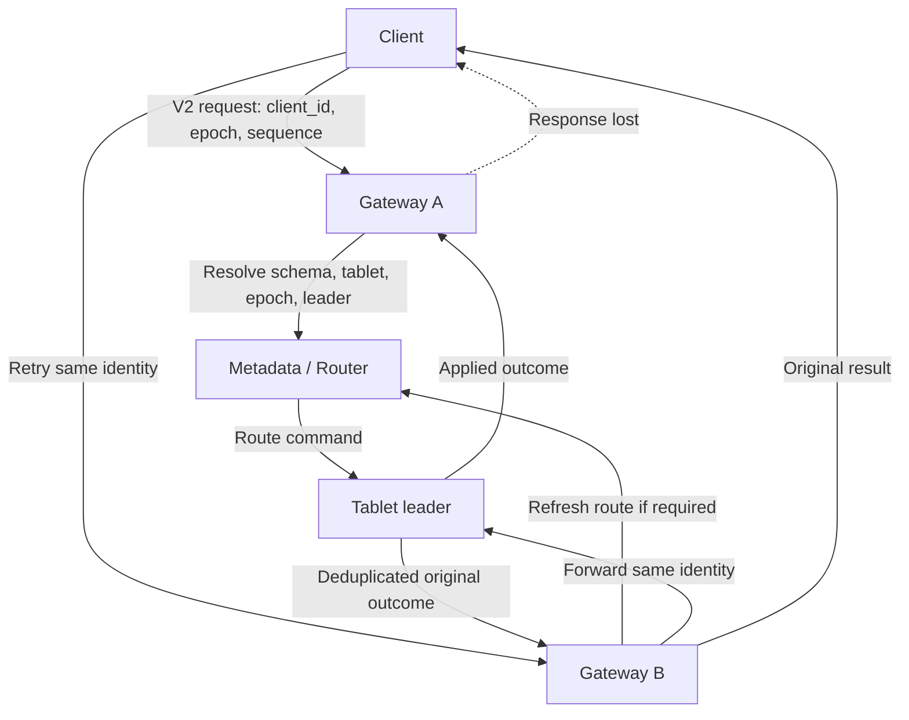
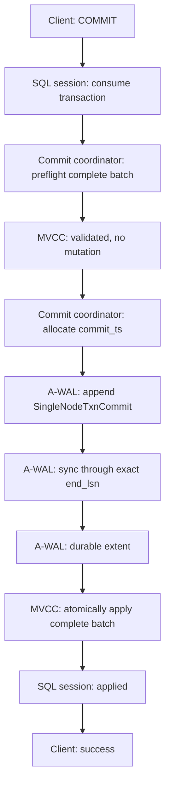
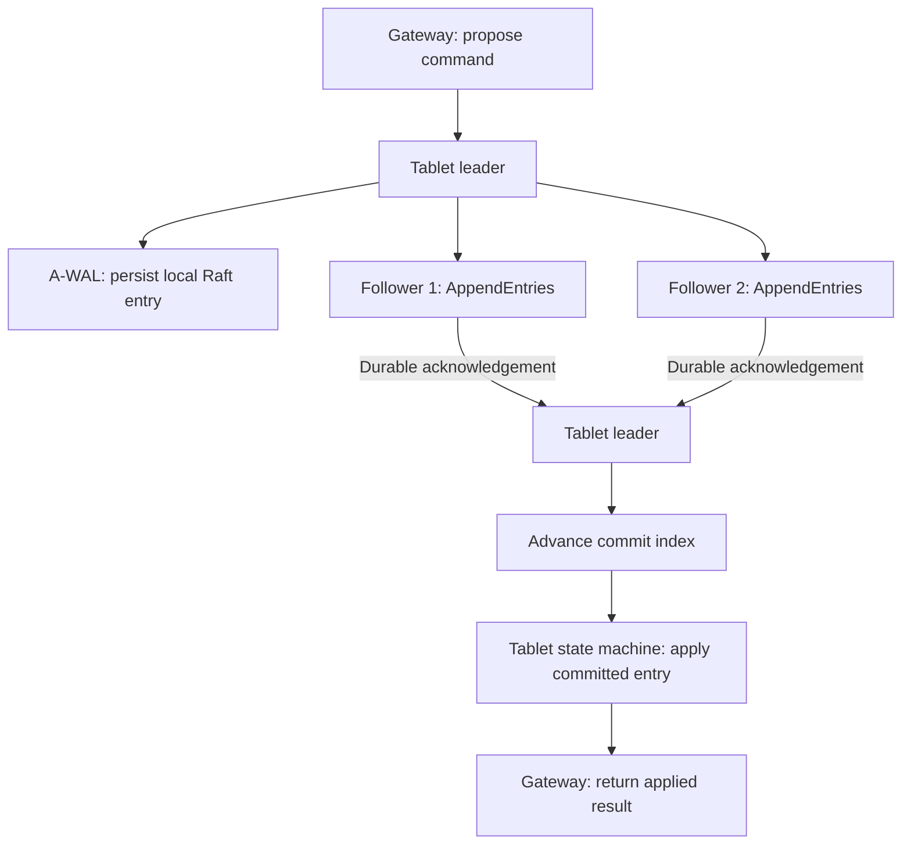

# RagnorDB

A distributed transactional SQL database, built from scratch in Rust.

RagnorDB lowers SQL into typed logical plans, executes those plans against
transaction-aware tablets, stores rows under ordered keys with MVCC, and
routes replicated tablet commands through a bounded MultiRaft host.

The working system includes the durable local SQL path and the replicated
cluster path: SQL sessions, immutable schema and routing snapshots, metadata
ownership, tablet routing, Raft proposal and apply, A-WAL persistence,
snapshots, membership, leadership transfer, linearizable leader reads, request
identity and deduplication, checkpoint recovery, and the TCP/admin surfaces are
connected end to end.

---

## Workspace

| Crate | Status | What it provides |
|---|---|---|
| `ragnordb-common` | working | Stable IDs, canonical errors, V1 and V2 client framing, request identity, row/value types, deterministic storage encoding, and `prost` schemas for metadata, MVCC, tablet commands, RPC messages, Raft persistence, database WAL records, and snapshots |
| `ragnordb-sql` | working | `sqlparser-rs` adapter, semantic analyzer, binder, typed expressions, wildcard expansion, unsupported-SQL rejection, and parser-independent logical planning |
| `ragnordb-catalog` | working durably | Immutable schema snapshots, stable table/column/node/tablet identities, deterministic table enumeration, primary-key metadata, metadata lifecycle publication, and recovery-safe allocator restoration |
| `ragnordb-txn` | working durably | Monotonic local transaction IDs and timestamps, snapshot start timestamps, deterministic ordered write sets, complete commit preflight, serialized WAL-before-MVCC commit coordination, and recovery-restored allocator floors |
| `ragnordb-storage` | working durably | Canonical ordered keys, in-memory MVCC, versioned database WAL records, A-WAL adapters, semantic replay, checksummed snapshot files, checkpoint publication, retention pins, and fail-closed recovery validation |
| `ragnordb-tablet` | working durably | Tablet ownership validation, point reads, ordered scans, read-your-writes overlays, statement-level mutation batches, replicated command/state-machine interfaces, snapshot state, and atomic local commits |
| `ragnordb-exec` | working durably | Logical-plan execution, expression evaluation, local and routed tablet access paths, typed results, detached distributed execution views, autocommit and explicit transactions, and durable commit/failure integration |
| `ragnordb-server` | working durably | Exclusive data-directory ownership, private startup recovery, SQL gateway, V1/V2 protocol handling, metadata bootstrap, MultiRaft runtime, immutable schema/routing publication, evented RPC dispatch, lifecycle control, `/status`, `/status/groups`, and `/metrics` |
| `ragnordb-cli` | working | `node`, `sql`, `status`, and offline `inspect wal` commands, including an interactive request-response SQL shell and decoded database WAL diagnostics |
| `ragnordb-multiraft` | working | Many Raft groups per process, fixed ownership reactors, fair group scheduling, sparse timers, bounded message/proposal/apply queues, shared A-WAL persistence, Ready ordering, snapshots, membership, ReadIndex, leadership transfer, status, and recovery fencing |
| A-WAL | integrated | Exact append extents, append-and-sync, typed failure outcomes, segmented recovery, retention pins, pruning, and the shared persistence authority for local database and Raft records |
| Raft | integrated | Election, replication, current-term commit, ReadIndex, ConfState, snapshots, leadership transfer, crash/restart recovery, and deterministic transport are hosted by RagnorDB's MultiRaft runtime |
| Bloom Bloom | integrated dependency | Serialization and deserialization are smoke-tested; immutable-segment filtering is outside the current mutable MVCC path |

The complete workspace test suite covers unit, integration, TCP, MVCC,
transaction, WAL, checkpoint, recovery, inspection, metadata, replicated
tablet, MultiRaft transport, snapshot, leadership, membership, and external-
infrastructure smoke suites.

The current functional validation is:

```bash
cargo test --workspace --all-targets
cargo fmt --all --check
```

---

## Platform Support

RagnorDB and A-WAL currently support Linux only. A-WAL's positional file I/O,
directory synchronization, and durability tests target Linux filesystem
semantics. Other platforms are not a supported deployment target until their
equivalent primitives and crash tests are implemented.

---

## Current System

RagnorDB is a row-oriented distributed OLTP database with a durable local
compatibility path and a replicated metadata/tablet path.

A statement entering RagnorDB should eventually travel through every layer of
the system:

```text
SQL text
  -> syntax parsing
  -> semantic binding and type checking
  -> logical planning
  -> transaction/session policy
  -> physical access-path selection
  -> ordered key/value operations
  -> tablet routing
  -> replicated tablet commands
  -> MVCC state-machine application
  -> durable Raft log and snapshots
```

That vertical path is the point of the project. The SQL frontend, transaction
model, ordered encodings, tablet ownership, WAL integration, consensus runtime,
and failure testing are implemented as one system instead of unrelated demos.

The architecture belongs to the same broad family as CockroachDB and TiDB/TiKV:

- SQL is translated into operations over ordered keys;
- tables are partitioned into independently owned tablets;
- each tablet is replicated by its own Raft group;
- metadata and timestamp allocation are themselves replicated;
- transactions carry stable start and commit timestamps;
- client requests carry stable logical identity across routes and retries;
- cross-tablet transaction coordination is deliberately not advertised as a
  current guarantee;
- storage recovery and consensus recovery share one authoritative log model.

The goal is not to imitate the surface syntax of those systems. The goal is to
understand and implement the machinery that makes their guarantees possible.

---

## Build

### Required repository layout

RagnorDB currently uses local path dependencies for the independently developed
Raft, A-WAL, and Bloom Bloom projects.

The directory layout must be:

```text
ragnordb-workspace/
├── ragnordb/
├── wal/
├── bloom-bloom/
└── Papers/
    └── raft/
```

Create it with:

```bash
mkdir ragnordb-workspace
cd ragnordb-workspace

git clone https://github.com/Aditya-1304/ragnordb.git
git clone https://github.com/Aditya-1304/A-WAL.git wal
git clone https://github.com/Aditya-1304/bloom-bloom.git

mkdir -p Papers
git clone https://github.com/Aditya-1304/raft.git Papers/raft

cd ragnordb
```

Build the complete workspace:

```bash
cargo build --workspace
```

Run the complete test suite:

```bash
cargo test --workspace --all-targets
```

Run Clippy with warnings treated as errors:

```bash
cargo clippy --workspace --all-targets -- -D warnings
```

The workspace uses Rust edition 2024 and Cargo resolver 3.

---

## Run the Database

### Start a node

```bash
RUST_LOG=info cargo run -p ragnordb-cli --bin ragnordb -- \
  node \
  --id 1 \
  --data-dir ./data/n1 \
  --listen 127.0.0.1:7101
```

This command starts the local compatibility path. The SQL listener runs on
`127.0.0.1:7101`.

Unless explicitly configured, the admin server derives its port by adding 100
to the SQL port:

```text
SQL protocol:  127.0.0.1:7101
Admin HTTP:    127.0.0.1:7201
```

The data directory is created during startup and is the durable local database
identity. It contains the process-ownership lock, A-WAL control state and
segments, and any published snapshot files:

```text
data/n1/
├── .ragnordb.lock
├── wal/
│   ├── wal.control
│   └── <segment-id>_<base-lsn>.wal
└── snapshots/
    └── snapshot-<snapshot-id>.ragnor
```

The live catalog and MVCC maps remain in memory for execution speed, but every
acknowledged catalog change and data mutation is recoverable from A-WAL or from
a validated checkpoint plus its WAL suffix.

For a replicated cluster, start each configured node with its validated TOML
file:

```bash
cargo run -p ragnordb-cli --bin ragnordb -- \
  node --config ./node-1.toml
```

The cluster runtime bootstraps or recovers the metadata group, publishes
schema and routing snapshots, hosts tablet groups through fixed reactors, and
serves SQL through any available gateway. Raft traffic and snapshot streams
use separate configured endpoints.

### Open the SQL shell

In another terminal:

```bash
cargo run -p ragnordb-cli --bin ragnordb -- \
  sql --addr 127.0.0.1:7101
```

The shell follows the V1 one-request-at-a-time protocol. V2-aware clients use
the same SQL surface with stable request identity and retry metadata:

```text
1. draw the prompt
2. read one SQL statement
3. send one request frame
4. wait for exactly one response frame
5. pretty-print the JSON response
6. draw the next prompt
```

One input line represents one statement. The shell does not currently collect a
multi-line statement before sending it.

Exit with `exit` or `quit`.

---

## A Complete SQL Session

Create a table:

```sql
CREATE TABLE users (id INT PRIMARY KEY, name TEXT NOT NULL, active BOOL);
```

Response:

```json
{
  "columns": [],
  "ok": true,
  "result": {
    "table_id": 1,
    "type": "created_table"
  },
  "rows": [],
  "stats": {
    "rows_read": 0,
    "rows_written": 0
  }
}
```

Insert rows through autocommit:

```sql
INSERT INTO users (id, name, active) VALUES (1, 'Adi', true), (2, 'Mandal', true);
```

```json
{
  "columns": [],
  "ok": true,
  "result": {
    "affected_rows": 2,
    "operation": "insert",
    "type": "mutation"
  },
  "rows": [],
  "stats": {
    "rows_read": 0,
    "rows_written": 2
  }
}
```

Read the table:

```sql
SELECT id, name, active FROM users;
```

```json
{
  "columns": [
    "id",
    "name",
    "active"
  ],
  "ok": true,
  "rows": [
    [
      1,
      "Adi",
      true
    ],
    [
      2,
      "Mandal",
      true
    ]
  ],
  "stats": {
    "rows_read": 2,
    "rows_written": 0
  }
}
```

Use an explicit transaction:

```sql
BEGIN;
UPDATE users SET name = 'Aditya Mandal' WHERE id = 1;
SELECT id, name FROM users WHERE id = 1;
COMMIT;
```

The `SELECT` inside the transaction sees `"Ada Lovelace"` before commit. The
pending update lives in the transaction's ordered write set, and the tablet
checks that write set before consulting committed MVCC state.

Rollback discards the same pending state:

```sql
BEGIN;
UPDATE users SET name = 'temporary' WHERE id = 1;
ROLLBACK;

SELECT id, name FROM users WHERE id = 1;
```

The final query still returns `"Ada Lovelace"`.

Inspect the catalog:

```sql
SHOW TABLES;
```

Delete through autocommit:

```sql
DELETE FROM users WHERE id = 2;
```

Every standalone DML or `SELECT` statement receives a real transaction ID and
snapshot timestamp. Autocommit is session policy around the same transaction
and tablet APIs used by explicit transactions; it is not a separate shortcut
around MVCC. Successful standalone mutations are acknowledged only after their
complete commit record is synchronized through its exact A-WAL `end_lsn`.

Stop the node with `Ctrl+C`, restart it with the same node ID and data
directory, and run the final `SELECT` again. The table and its committed rows
are reconstructed before the SQL listener accepts another connection.

Inspect the durable history only while the node is stopped:

```bash
cargo run -p ragnordb-cli --bin ragnordb -- \
  inspect wal \
  --data-dir ./data/n1 \
  --node-id 1
```

The inspector prints A-WAL's physical recovery report followed by decoded
`CatalogUpdate`, `SingleNodeTxnCommit`, `SnapshotPointer`, and
`CheckpointMarker` records. It is deliberately offline-only: the command must
acquire the same exclusive data-directory lock held by the live server.

---

## Features

### SQL frontend

- Exactly one SQL statement per request.
- `sqlparser-rs` is isolated behind the parser and analyzer boundary.
- Table and column names are resolved into stable IDs.
- `SELECT *` expands into explicit catalog-ordered columns during binding.
- Expressions are typed before planning.
- Nullability is tracked through expressions and assignments.
- Unsupported syntax is rejected instead of being silently ignored.
- The planner consumes only RagnorDB-owned bound structures.
- The executor has no direct dependency on parser AST types.

### SQL statements

The current surface includes:

```sql
CREATE TABLE
INSERT INTO ... VALUES
SELECT ... FROM ... WHERE ...
UPDATE ... SET ... WHERE ...
DELETE FROM ... WHERE ...
BEGIN
COMMIT
ROLLBACK
SHOW TABLES
```

`START TRANSACTION` is accepted only in its supported plain form. Transaction
modes, chaining, savepoints, and other modifiers are rejected.

### SQL types

| SQL type | Internal value | Notes |
|---|---|---|
| `INT` | `i64` | Ordered primary-key encoding preserves signed numeric order |
| `TEXT` | UTF-8 `String` | Ordered encoding preserves binary UTF-8 order |
| `BOOL` | `bool` | Primary-key encoding preserves `false < true` |
| `NULL` | explicit null variant | Allowed only where schema and expression rules permit it |

Primary keys cannot be null. Every table must have at least one primary-key
column.

Composite primary keys are represented as ordered, self-delimiting tuples
rather than concatenated values with ambiguous boundaries.

### Expressions

The expression engine currently supports:

```text
Arithmetic:
  +  -  *  /  %

Comparison:
  =  !=  <  <=  >  >=

Boolean:
  AND  OR  NOT

Null predicates:
  IS NULL
  IS NOT NULL

Unary:
  +value
  -value
```

Boolean evaluation follows SQL three-valued logic. Comparisons involving
`NULL` produce unknown rather than ordinary `true` or `false`; a `WHERE`
predicate selects only rows for which the final result is `true`.

Division by zero and signed arithmetic overflow return typed errors instead of
panicking or wrapping.

### Catalog

- Stable nonzero table IDs.
- Stable nonzero column IDs.
- Schema versions.
- Ordered primary-key column IDs.
- Deterministic table enumeration by table ID.
- Lookup by table name and table ID.
- Immutable `Arc<TableSchema>` snapshots.
- Validation of duplicate names, duplicate IDs, missing keys, invalid
  nullability, and malformed durable definitions.
- Idempotent installation of identical assigned metadata.
- Stable node and replica identities.
- Metadata-owned table, tablet, placement, schema, and node lifecycle records.
- Immutable published schema snapshots and ordered tablet routing snapshots.
- Tablet epochs and replica/leader hints for stale-route detection and refresh.

### Transactions

- Monotonic nonzero local transaction IDs.
- Monotonic nonzero snapshot timestamps.
- Commit timestamps strictly greater than start timestamps.
- Deterministic `BTreeMap` write sets.
- Read-your-writes for inserts, updates, and deletes.
- Atomic statement-batch buffering.
- Atomic single-tablet commit validation.
- Write-write conflict detection.
- Explicit rollback.
- Autocommit implicit transactions.
- Read-only commits that do not invent a commit timestamp.
- Transaction state isolated per client connection.
- Shared database-wide transaction and timestamp allocation.

### Tablet and storage engine

- Local and replicated tablet ownership.
- Half-open encoded-key ranges with table and tablet identity validation.
- Tablet epochs, replica placement, leader hints, and stale-route rejection.
- Tablet ownership validation for reads, writes, scan bounds, and commits.
- Canonical ordered row keys.
- Canonical versioned row encoding.
- Point reads.
- Half-open ordered scans.
- Pending-write overlays.
- Put and delete mutations.
- Snapshot visibility.
- Write tombstones.
- Rollback records.
- Atomic multi-key commit validation.
- Corruption detection for broken write/default relationships.
- Idempotent replay checks inside the MVCC batch interface.
- Replicated command decoding and deterministic state-machine application.
- Tablet snapshots with applied-index and identity validation.
- Linearizable leader reads through Raft ReadIndex.

### Server and protocol

- Length-prefixed TCP protocol.
- V1 connection-scoped requests and V2 stable client request identity.
- Session epochs, request sequences, acknowledgment floors, and deduplication.
- One session per connection.
- One in-flight statement per connection.
- Configurable maximum connection count.
- Configurable statement-admission deadline and shutdown grace period.
- Shared database state across connections.
- Stable success and error JSON.
- Internal error-detail redaction.
- Configurable `off`, `metadata-only`, `redacted`, or `full` SQL logging;
  `metadata-only` is the safe default.
- Prometheus metrics.
- JSON node status.
- Bounded `/status` aggregate/top-K and complete `/status/groups` diagnostics.
- Metadata-group bootstrap and recovery of durable cluster membership.
- Evented bounded control/tablet RPC dispatch without one OS thread per request.
- Detached distributed execution views that do not hold a node-global SQL lock
  across remote waits.
- Node lifecycle, drain, leadership transfer, and membership control surfaces.
- Build information for RagnorDB and its infrastructure dependencies.
- SIGINT/SIGTERM shutdown with connection draining and an explicit A-WAL clean
  shutdown witness.

### Durability and recovery

- Versioned `CatalogUpdate`, `SingleNodeTxnCommit`, `SnapshotPointer`, and
  `CheckpointMarker` protobuf records.
- Versioned `RaftLogEntry`, `RaftHardState`, and `RaftSnapshotPointer` records.
- Exact half-open A-WAL append extents `[start_lsn, end_lsn)`.
- Commit acknowledgement only after synchronization through the exact
  `end_lsn`.
- Complete MVCC preflight before any transaction record is appended.
- WAL-before-MVCC publication for autocommit and explicit transactions.
- Durable catalog publication before a created table becomes visible.
- Distinct definitely-not-staged and outcome-unknown failure contracts.
- Sticky recovery-required state after uncertain mutating I/O.
- Ordered, idempotent semantic replay of catalog and transaction records.
- Recovery-restored transaction, timestamp, table, and snapshot allocators.
- Newest-tail repair without hiding sealed-history corruption.
- Checksummed snapshot files containing catalog, MVCC, and allocator state.
- Matching pointer-and-marker checkpoint selection.
- Live checkpoint publication with retention-pin and pruning ownership.
- Explicit restart proof that an uncommitted transaction never appears.
- Shared A-WAL persistence authority for database and Raft records.
- FIFO `Ready` persistence, safe message release, commit advancement, and
  ordered apply with recovery fencing.

### Operational storage safety

- One exclusive process lock per data directory.
- Recovery completes before SQL and admin listeners are bound.
- Startup recovery holds a retention pin over its required WAL history.
- Checkpoint publication pins the captured recovery path until its marker is
  durable.
- Standalone WAL inspection opens A-WAL read-only and never repairs data.
- The offline inspector rejects a directory still owned by a running node.
- Malformed RagnorDB payloads produce precise diagnostics and a nonzero exit
  without hiding later physically valid records.

---

## Current Architecture

Every connection owns its session. The server publishes immutable schema and
routing views to the SQL frontend, while mutable metadata, tablet, and Raft
state is owned by fixed reactors. The local compatibility path still uses a
shared database lock; the distributed path does not hold a node-global SQL
lock across RPC, persistence, Raft advancement, or tablet apply.



In local compatibility mode, the asynchronous mutex serializes physical
statement execution while allowing explicit transactions from different
connections to interleave between statements. The mutex is released before
response I/O and checkpoint file work.

In distributed mode, the SQL frontend reads immutable published views and
submits bounded requests to the owning reactor. The reactor owns the mutable
tablet or metadata state, the persistence service owns the shared A-WAL
ordering, and committed entries are applied in log order. Queue budgets,
owner generations, and recovery fences prevent stale work from publishing
after ownership or recovery changes.

---

## Replicated Cluster Architecture

The distributed system keeps the same SQL, transaction, and tablet concepts but
assigns each mutable state machine to one reactor and makes the replicated log
the commit authority.



Any node may accept a SQL request. The receiving node becomes the gateway for
that request, reads the immutable schema and placement snapshots, encodes the
affected keys, and forwards operations to the relevant tablet owner.

The cluster contains one metadata Raft group plus one Raft group per tablet. A
process hosts multiple independent groups through one bounded MultiRaft host;
there is no OS thread or unbounded queue per group. Raft `Ready` records are
persisted in FIFO order by the dedicated persistence service, then committed
entries are applied in order to the owning tablet or metadata state machine.

Metadata owns node, table, tablet, placement, schema, and lifecycle records.
Routing updates publish a new immutable snapshot with an epoch. A stale route
is rejected and refreshed rather than applied to the wrong tablet. The admin
surface exposes bounded aggregate status at `/status` and detailed per-group
status at `/status/groups`.

---

## The SQL Pipeline Is Four Representations, Not One

The query path deliberately uses separate representations for parsing,
semantic meaning, planning, and execution.



This looks heavier than passing a `sqlparser::ast::Statement` directly into the
executor. The separation is what prevents the SQL parser from becoming the
database's internal type system.

The parsed statement describes what the client wrote. It may still contain
unknown tables, unknown columns, unsupported clauses, type mismatches, and
wildcards.

The bound statement describes what the SQL means inside the current catalog. A
column is no longer merely the string `"name"`; it carries its table ID, column
ID, ordinal, type, nullability, and schema version context.

The logical plan preserves those stable identities and removes syntax-level
ambiguity. It does not carry parser identifiers or unresolved wildcards.

The executor receives only a plan the analyzer has already proven belongs to
the supported SQL subset. That gives each boundary a narrow test surface:

- parser tests operate on source text;
- analyzer tests operate on syntax plus catalog metadata;
- planner tests prove structural lowering;
- executor tests operate on RagnorDB-owned plans and storage state.

A grammar change should not force the tablet layer to change. A new storage
access path should not require the parser to understand MVCC. The separate
representations are what make those statements true in code.

---

## Design Notes

These are the architectural choices that shape the code and the tradeoffs
behind them.

### Parser types stop at the binder

Only the parser and analyzer may inspect `sqlparser` AST types.

The convenient alternative would be to pass the parser's statement tree into
the planner and let every layer pull out the fields it needs. That creates a
distributed semantic-analysis problem: the planner resolves some names, the
executor rejects some unsupported clauses, and storage code eventually receives
values whose types were never checked in one authoritative place.

RagnorDB performs the semantic work once. The analyzer resolves names, types
expressions, validates statement shapes, expands wildcards, and produces a
closed RagnorDB-owned representation.

The planner and executor therefore cannot accidentally begin depending on a
parser-specific node introduced by a library upgrade.

### Stable IDs leave the binder, not raw names

Names are client-facing schema labels. They are not durable identities.

After binding, table and column references carry:

- `TableId`;
- schema version;
- `ColumnId`;
- physical row ordinal;
- logical type;
- nullability;
- the client-visible name used in results.

This matters because names can eventually change while existing rows, indexes,
WAL records, and Raft commands still need stable references.

Even before schema evolution exists, using stable IDs prevents the current
executor from repeatedly resolving strings and makes immutable metadata
publication explicit.

### `SELECT *` is expanded during binding

The planner never sees an unresolved wildcard.

Expanding `*` requires the current table schema and a deterministic column
order. That is semantic catalog work, so it belongs in the binder.

If wildcard expansion happened in the executor, the same prepared logical plan
could change meaning when executed against a new schema version. By recording
the exact bound columns, the plan says precisely what it projects.

### Planning is infallible by design

The public planner shape is:

```text
plan(BoundStatement) -> Plan
```

not:

```text
plan(BoundStatement) -> Result<Plan>
```

This is not because planning can never become fallible. It is because the
current planner performs only structural lowering. Name resolution, type
checking, wildcard expansion, unsupported-clause rejection, and expression
binding have already happened.

Adding a `Result` merely to repeat analyzer checks would blur ownership and make
errors depend on which downstream function happened to notice them first.

When cost-based optimization or distributed plan construction introduces real
planning failures, those failures can be added at the layer that owns them.
The current interface documents the current responsibility accurately.

### Primary-key completeness selects a point lookup

The executor can derive an exact point lookup only when the filter supplies an
equality constraint for every primary-key component.

For a single-column key:

```sql
SELECT * FROM users WHERE id = 1;
```

can address one canonical row key.

For a composite key:

```sql
PRIMARY KEY (tenant_id, user_id)
```

the executor requires equality for both columns before selecting the point
path. A predicate on only `tenant_id` is not silently treated as one exact key;
it falls back to a scan and filter.

This keeps the optimization correct before it is fast. Ordered range routing
extends access-path selection without changing the bound expression model;
secondary indexes remain outside the current SQL surface.

### Statements are prepared before transaction state changes

Multi-row inserts, updates, and deletes are statement-atomic.

The executor first computes the complete intended mutation batch:

```text
1. resolve and validate bound metadata
2. scan or point-read candidate rows
3. evaluate predicates and assignments
4. construct final rows
5. construct canonical primary keys
6. reject duplicate or malformed keys
7. validate every mutation
8. merge the complete batch into the transaction
```

The transaction is not modified during steps 1 through 7.

This matters inside explicit transactions. Suppose an earlier statement already
buffered valid writes and a later multi-row statement fails on its final row.
The earlier statement must remain, while none of the failing statement's rows
may leak into the write set.

The batch boundary provides exactly that behavior.

### The write set is a `BTreeMap`

A transaction stores pending mutations as:

```text
canonical encoded row key -> Put(row bytes) or Delete
```

A `BTreeMap` gives deterministic encoded-key order. This helps tests and matters
for command encoding, replay, and reproducible scheduling.

Writing the same key more than once replaces the previous pending mutation. The
write set represents the transaction's final intended state, not an append-only
history of every SQL assignment that produced it.

The WAL and Raft command layers may preserve operation history when required by
their durable format. The transaction-local set exists to describe what should
be committed.

### Tablet ownership uses ordered ranges

Each tablet owns a `TableId` and a half-open encoded-key range. The metadata
group publishes the tablet identity, epoch, replica set, leader hint, and range
in an immutable routing snapshot. A bootstrap table may begin with one full
range; additional tablet assignments use the same ownership contract.

The tablet validates ownership for:

- point reads;
- inserts;
- updates;
- deletes;
- scan start bounds;
- scan end bounds;
- pending transaction mutations;
- final commit batches.

Without that validation, a transaction containing an encoded foreign-table key
could be committed into the wrong tablet and surface as corrupted
scan output.

Every row operation proves that its key, scan bounds, mutation batch, replayed
command, or snapshot belongs to the tablet's current range and epoch. Stale
routes fail with a retryable routing error and cannot publish into the wrong
owner.

### MVCC uses `default`, `lock`, and `write`

The in-memory engine models three logical maps:

```text
default/{row_key}/{start_ts} -> encoded row
lock/{row_key}               -> uncommitted lock
write/{row_key}/{write_ts}   -> write record
```

The `default` map stores row payloads under the transaction start timestamp.
The `write` map is the committed version index searched by snapshot readers. A
put write record points back to its payload in `default`.

Deletes are represented as write tombstones. Once a reader finds the newest
visible delete, older puts stay hidden.

Rollback records are not row deletions. They state that one transaction attempt
was aborted, so the reader skips that record and continues searching older
committed versions.

The lock map participates in the storage contract and conflict checks. The
current replicated SQL contract is single-tablet atomicity; durable distributed
prewrite, transaction status records, TTLs, heartbeats, and intent resolution
are not advertised.

### Rollback is stored at `start_ts`

A rollback does not receive a successful transaction commit timestamp. It
records the fact that the transaction identified by its start timestamp must
not be resurrected by delayed messages.

For that reason the rollback record is indexed at the aborted transaction's
`start_ts`.

Allocating a new timestamp just for rollback would give the record a visibility
position unrelated to the transaction it protects. Storing it at the start
timestamp makes replay and delayed-commit rejection deterministic.

### Snapshot readers follow write records to data

A snapshot read at `read_ts` does not simply fetch the latest row payload.

It performs:

```text
1. check this transaction's pending write set
2. check for a conflicting visible lock
3. find the newest write record where write_ts <= read_ts
4. skip rollback records
5. return missing for a delete record
6. for a put, load default/{key}/{write.start_ts}
7. validate and decode the canonical row
```

Separating the committed version index from row bytes makes uncommitted data and
transaction decisions explicit. It gives intent resolution and MVCC garbage
collection a concrete model to operate on.

### Missing payloads are corruption, not missing rows

A visible `Put` record that references no corresponding `default` value is a
broken storage invariant.

Returning `None` would make physical corruption indistinguishable from a row
that was never inserted. RagnorDB instead returns `CorruptData` and prevents the
damaged state from being presented as a valid SQL result.

The same rule applies to malformed keys, noncanonical rows, invalid record
timestamps, partial replays, and conflicting replay data.

“Not found” is a logical database result. “The bytes required to prove the
committed row are missing” is a storage failure.

### Read-only transactions do not allocate commit timestamps

A read-only transaction needs a start timestamp to define its snapshot. It has
no mutations to make visible, so there is nothing for a commit timestamp to
order.

The session commits a read-only transaction as a no-op and clears it without
advancing the commit-timestamp allocator.

This distinction matters when the local allocator is replaced by a distributed
timestamp service. Read-heavy workloads should not consume global commit
timestamps for state changes that do not exist.

### Commit consumes the transaction

A transaction is moved into the commit operation rather than borrowed for
reuse.

After successful commit, reusing it would risk applying the same logical writes
twice. After failed commit, reusing it would risk carrying a snapshot and write
set whose conflict assumptions are no longer valid.

Consuming the value makes both errors impossible at the Rust type boundary.
Retries start a new transaction with a new snapshot.

### Autocommit belongs to the session layer

The lower-level executor requires a transaction for DML and `SELECT`. It does
not quietly invent one.

`SqlSession` owns the policy:

- create an implicit transaction for standalone data statements;
- execute the statement;
- rollback the implicit transaction on failure;
- allocate a commit timestamp only when writes exist;
- commit successful writes;
- keep explicit transactions attached across statements;
- clear them on `COMMIT` or `ROLLBACK`.

This separation allows tests and internal callers to use the executor
without inheriting SQL connection behavior.

It also means another protocol can implement a different session model while
reusing the same executor and tablet APIs.

### Explicit statement errors preserve the transaction

A failed statement inside an explicit transaction does not automatically erase
earlier successful statements.

That behavior is safe because each statement prepares and validates its complete
mutation batch before merging it into the transaction. A failing statement adds
nothing, while the transaction's previous write set remains intact.

Parse and analysis failures occur even earlier and therefore do not touch
transaction state.

This differs from an implicit transaction, where the entire transaction exists
only for one statement and is discarded automatically on any error.

### `CREATE TABLE` is autocommit-only

Transactional DDL creates a more complex atomicity problem than row mutation.
Catalog publication and tablet creation would need to participate in the same
durable protocol as user data, including rollback and recovery.

The current engine does not pretend to provide that protocol. `CREATE TABLE`
runs only outside an explicit transaction and publishes its catalog entry and
local tablet together.

This is a deliberately narrow contract. Transactional schema changes require
metadata coordination and an explicit schema-evolution protocol.

### Cross-table writes fail before being claimed as atomic

The local transaction type can technically buffer encoded rows from more than
one table. The current executor refuses to commit a write set spanning multiple
tablets.

A cross-table transaction requires coordination between independent owners. In
the distributed design that means prewrite, transaction status, commit,
rollback, retry, and crash recovery.

Locally applying tablet A and then tablet B would create a partial-commit window
and teach callers a guarantee the current distributed engine does not provide.
The current engine returns a clear unsupported error instead.

### Ordered storage encoding is not protobuf encoding

RagnorDB uses Protobuf for durable records and cross-node messages. It does not
use arbitrary protobuf serialization as an ordered database key.

Storage keys require properties Protobuf does not promise:

- bytewise order matching logical primary-key order;
- canonical representation;
- stable type tags;
- unambiguous tuple boundaries;
- deterministic rejection of noncanonical bytes.

The storage encoder therefore has its own versioned format.

This is a deliberate duplication of representation, not accidental codec
sprawl. Protobuf answers “how do independently versioned processes exchange a
record?” The storage codec answers “how do values sort and compare as database
keys?”

### Signed integers flip the sign bit

Plain big-endian two's-complement bytes do not place negative and positive
signed integers in normal numeric order when compared lexicographically.

RagnorDB flips the high sign bit before writing the integer as big-endian:

```text
logical signed order
    -> sign-bit transformation
    -> unsigned big-endian bytes
    -> lexicographic byte order
```

The transformation maps the full signed range into unsigned order without
changing equality or requiring variable-length encoding.

Golden-byte and ordering tests cover negative values, zero, positive values,
and the signed extremes.

### Text keys are escaped and prefix-free

Concatenating UTF-8 strings with an ordinary delimiter is ambiguous when the
delimiter appears inside a value.

RagnorDB escapes zero bytes and terminates each text component with a reserved
sequence. This preserves binary UTF-8 order while making every component
self-delimiting.

The important property for composite keys is prefix freedom: encoding
`("a", "bc")` must never collide with or become indistinguishable from
`("ab", "c")`.

### JSON ends at the server boundary

The executor returns typed `ExecutionResult`, `ResultSet`, `ResultColumn`, and
RagnorDB `Value` structures.

Only the server protocol module converts those values to JSON.

Keeping JSON out of the execution engine means:

- storage does not depend on a client serialization format;
- transaction results can be reused by another protocol;
- another binary or PostgreSQL-compatible protocol does not require rewriting
  the executor;
- internal types retain SQL-specific distinctions instead of collapsing into
  generic JSON values too early.

### Execution ownership has two explicit modes

The local compatibility path uses one `tokio::sync::Mutex` around the local
executor and transaction manager. That boundary preserves one catalog, one
tablet set, monotonic local allocators, and a coherent local statement view.
The lock is released before response I/O and detached checkpoint file work.

The distributed path uses `DatabaseServices` plus immutable published schema
and routing snapshots. A routed request is sent through bounded evented RPC to
the owning metadata or tablet reactor. No node-global SQL lock is held while
waiting for a remote response, persisting a Raft `Ready`, or applying a
committed command. Each mutable group has one owner generation, and stale
completion work is rejected when that generation changes.

### A closed connection discards its transaction

An explicit transaction is owned by its connection's `SqlSession`.

If the connection closes before `COMMIT`, dropping the session drops the
transaction and its buffered write set. Because local pending writes have not
been published into MVCC storage, no rollback record is necessary for this
path.

If a distributed transaction protocol is introduced, provisional records
would require durable transaction status, heartbeats, TTLs, and intent cleanup;
the current implementation does not advertise cross-tablet atomicity.

### The error enum is semantic, not stringly typed

Internal layers return one canonical error enum containing variants such as:

```text
SqlParse
UnsupportedSql
SchemaMismatch
ConstraintViolation
WriteConflict
InvalidArgument
CorruptData
Configuration
WalAppendNotStaged
CommitOutcomeUnknown
CatalogOutcomeUnknown
CheckpointOutcomeUnknown
RecoveryRequired
RecoveryFailed
NotImplemented
```

The server maps variants to stable wire codes. It does not inspect error text to
guess whether an error is retryable.

That keeps human-readable messages free to improve without breaking clients and
prevents a constraint violation from accidentally being advertised as a
retryable conflict.

Corruption and configuration details are logged internally and replaced by a
safe client-facing `INTERNAL_ERROR`.

### The one-log rule is non-negotiable

In replicated mode, the Raft log is the authoritative commit log.

The forbidden path is:

```text
mutate local tablet
  -> report success
  -> attempt asynchronous replication
```

That path cannot provide strong consistency. A leader failure after local
success but before replication can lose an acknowledged write.

The implemented replicated path is:

```text
propose command
  -> persist Raft entry
  -> replicate to quorum
  -> mark committed
  -> apply to tablet state machine
  -> report success
```

A-WAL provides durable local storage underneath Raft. It does not independently
decide when a replicated command is committed.

Single-node mode already follows the same singular-authority rule. One
`SingleNodeTxnCommit` record is the durable commit decision; MVCC is the
reconstructed applied state. Replicated mode replaces that standalone record
with the tablet's Raft entry rather than retaining two competing commit logs.

### Durable success follows the exact WAL extent

A-WAL returns the exact half-open logical extent of every appended database
record:

```text
[start_lsn, end_lsn)
```

`start_lsn` identifies the record header. `end_lsn` is A-WAL's logical frontier
immediately after the complete framing, payload, checksum, and alignment of
that record. RagnorDB never derives the target from protobuf length and never
synchronizes only through the starting LSN.

The local commit coordinator returns success only after A-WAL proves
`durable_lsn >= end_lsn`. It then applies the complete mutation batch to MVCC.
This ordering makes the durable record authoritative if the process stops
between synchronization and in-memory publication.

### Preflight happens before durable publication

The coordinator validates the entire transaction before allocating its final
commit timestamp or appending a commit record. Validation covers transaction
metadata, tablet ownership, canonical keys and rows, conflicting locks,
rollbacks, and committed versions newer than the transaction snapshot.

A deterministic rejection therefore produces neither a durable commit record
nor a partial MVCC mutation. The preflight-through-apply interval is serialized
so another writer cannot invalidate the checked history before the durable
record is published locally.

### Outcome unknown is not an ordinary rollback

A-WAL distinguishes a record rejected before staging from one that acquired an
extent but encountered an I/O failure while becoming durable.

The latter returns `COMMIT_OUTCOME_UNKNOWN`. Recovery may retain or discard the
record depending on the maximal valid durable prefix, so the server cannot
truthfully report either success or abort. The transaction is removed from the
session, the writer enters recovery-required state, and the client must not
retry the operation as a fresh transaction.

### Recovery remains private until validation succeeds

Startup reconstructs catalog, MVCC, replay frontiers, and allocator maxima in
private state. It does not publish a `LocalDatabase` or bind client-facing
listeners while physical WAL recovery, snapshot validation, semantic decoding,
ordered replay, or allocator restoration is incomplete.

This prevents a session from observing a partially rebuilt catalog or
allocating an identity from the default zero state. Malformed protobufs,
unsupported versions, transaction records that precede their catalog, corrupt
selected snapshots, and allocator overflow all fail startup closed.

### A checkpoint is a file plus a matching WAL pair

A snapshot file alone is not a published checkpoint. RagnorDB first writes and
synchronizes the complete checksummed image, atomically renames it, and
synchronizes the snapshots directory. It then appends and synchronizes a
`SnapshotPointer` followed by an exactly matching `CheckpointMarker`.

Recovery ignores an orphan pointer and selects only a pointer-marker pair whose
snapshot ID, timestamp, and replay boundary match. WAL retention may advance
only after that pair is durable. The live checkpoint API owns the retention pin,
publication ordering, floor advancement, and physical pruning sequence.

### Offline inspection owns the storage lifetime

Read-only mode prevents the inspector itself from modifying A-WAL, but it does
not prevent another process from deleting retained segments. The server and
standalone inspector therefore acquire the same exclusive data-directory file
lock for their complete storage lifetimes.

An online inspection path would need to run through the server-owned WAL handle
and obtain a server-owned retention pin. Until that path exists,
`ragnordb inspect wal` fails immediately when the node is running.

---

## Current MVCC Model

The current engine implements local snapshot isolation over canonical encoded
keys.



A transaction reads at its fixed `start_ts`. Newer commits do not move that
snapshot forward.

Pending mutations are overlaid on both point reads and scans:

- pending puts appear;
- pending updates replace the committed version;
- pending deletes remove the row from the transaction's view.

At commit, every mutation is checked before any mutation is applied. If one key
conflicts, the complete batch fails.

The local model currently prevents conflicting concurrent writes. It does not
track arbitrary read sets or predicate ranges, so it does not claim full
serializable isolation. Write-skew anomalies remain possible under snapshot
isolation; the current contract is explicit snapshot isolation with write
conflict detection.

---

## Session State Machine



`autocommit()` is currently derived from whether an explicit transaction is
attached. There is no `SET autocommit` command yet.

`SHOW TABLES` reads catalog metadata and does not require an MVCC transaction.

Read-only transactions obtain a start timestamp but no commit timestamp.

A failed explicit commit clears the session transaction because the consumed
transaction cannot safely be reused.

---

## Wire Protocol

RagnorDB supports a small length-prefixed SQL protocol. V1 is the simple
connection-scoped form; V2 adds stable logical request identity so a client can
retry after a route change, leader transition, or lost response without
creating a second mutation.

Request frame:

```text
[len: u32 little-endian][UTF-8 SQL bytes]
```

Response frame:

```text
[len: u32 little-endian][UTF-8 JSON bytes]
```

V2 request metadata is represented by `ClientRequestV2`:

```text
protocol_version
client_id
client_session_epoch
request_sequence
acknowledged_through
statement_timeout_ms
sql
```

`client_id` and `request_sequence` identify the logical request independently
of the gateway, tablet route, or Raft leader. Session renewal advances the
epoch; the server rejects stale epochs and remembers the exact outcome for
deduplicable requests. A timeout after admission is reported as
`REQUEST_OUTCOME_UNKNOWN`, so clients do not blindly replay a non-idempotent
mutation.

The retry boundary is explicit:



The maximum request and response frame size is 16 MiB. Oversized request frames
are rejected before payload allocation, and oversized materialized responses
are rejected before any length prefix is written. Until streaming exists, a
query may materialize at most 100,000 result rows.

Protocol rules:

- one statement per request;
- one response per request;
- one in-flight request per connection;
- requests must contain valid UTF-8;
- result rows use JSON arrays;
- errors include a stable code and retryability flag;
- transaction state remains attached to the TCP connection.
- V2 retries preserve the same logical request identity and acknowledged floor.

Success response:

```json
{
  "ok": true,
  "columns": ["id", "name"],
  "rows": [[1, "Ada"]],
  "stats": {
    "rows_read": 1,
    "rows_written": 0
  }
}
```

Error response:

```json
{
  "ok": false,
  "error": {
    "code": "WRITE_CONFLICT",
    "message": "write conflict: row changed after transaction start",
    "retryable": true
  }
}
```

Current client-visible codes:

| Code | Retryable | Meaning |
|---|---:|---|
| `WRITE_CONFLICT` | yes | A committed version, rollback, or lock conflicts with the transaction snapshot |
| `CONSTRAINT_VIOLATION` | no | A primary-key, nullability, duplicate-row, or schema constraint failed |
| `SCHEMA_MISMATCH` | no | A table, column, type, or bound schema identity no longer matches |
| `UNSUPPORTED_SQL` | no | Parsed SQL is outside the implemented SQL surface |
| `SQL_PARSE_ERROR` | no | The parser could not construct a valid statement |
| `INVALID_ARGUMENT` | no | Session state or a logical request invariant is invalid |
| `STATEMENT_TIMEOUT` | yes | The request expired before acquiring the serialized database execution owner; execution did not begin |
| `REQUEST_OUTCOME_UNKNOWN` | no | A mutation was admitted but its final applied outcome was not observed; inspect or recover before retrying |
| `STALE_TABLET_EPOCH` | yes | The route epoch no longer matches metadata; refresh the routing snapshot |
| `NOT_LEADER` | yes | The selected tablet replica is not the current leader |
| `LEADER_UNKNOWN` | yes | The tablet has no usable leader hint yet |
| `TABLET_UNAVAILABLE` | yes | The selected tablet group is recovering, fenced, or overloaded |
| `CLIENT_SESSION_EXPIRED` | yes | The V2 session epoch is no longer current; renew the session |
| `REQUEST_ID_EXPIRED` | no | The request identity is outside the retained deduplication window |
| `METADATA_UNAVAILABLE` | yes | The metadata group cannot currently serve the requested schema or route |
| `CONNECTION_LIMIT` | yes | The server has no free connection permit |
| `COMMIT_OUTCOME_UNKNOWN` | no | A commit acquired a WAL extent but recovery must determine whether it became durable |
| `CATALOG_OUTCOME_UNKNOWN` | no | A catalog record acquired a WAL extent but recovery must determine its durable outcome |
| `CHECKPOINT_OUTCOME_UNKNOWN` | no | Checkpoint publication became uncertain and retention must not advance in the live process |
| `INTERNAL_ERROR` | no | Internal corruption or configuration detail was intentionally hidden |

---

## Operational Surface

### Node status

```bash
cargo run -p ragnordb-cli --bin ragnordb -- \
  status \
  --addr 127.0.0.1:7101 \
  --admin-addr 127.0.0.1:7201
```

The status command checks the SQL TCP port and reads the admin HTTP endpoint.

Direct access:

```bash
curl http://127.0.0.1:7201/status
```

The response reports:

- RagnorDB version;
- build target;
- Rust compiler version;
- build timestamp;
- feature flags;
- Raft version;
- A-WAL version;
- Bloom Bloom version;
- server start time;
- active connections;
- maximum connections;
- node-wide durability state and recovery-required reason;
- durable WAL LSN and retained bytes;
- latest checkpoint identity and replay frontier;
- active retention-pin count;
- bounded MultiRaft summary, including group count, pending message bytes,
  pending persistence bytes, and apply backlog totals;
- node lifecycle and drain state.

Detailed group diagnostics are available separately:

```bash
curl http://127.0.0.1:7201/status/groups
```

The group view includes role and leader, term, commit/applied/snapshot
frontiers, owner generation, membership, pending messages, persistence state,
apply-backlog entries/bytes/age, and quarantine or recovery state. The summary
endpoint is bounded and top-K; the group endpoint is the complete diagnostic
view.

The node lifecycle endpoint supports explicit drain and restart coordination:

```bash
curl http://127.0.0.1:7201/node/lifecycle
```

### Prometheus metrics

```bash
curl http://127.0.0.1:7201/metrics
```

Current metrics include:

```text
RagnorDB_connections_accepted_total
RagnorDB_connections_active
RagnorDB_requests_received_total
RagnorDB_requests_success_total
RagnorDB_requests_error_total
RagnorDB_response_rows_read_total
RagnorDB_response_rows_written_total
ragnordb_txn_commits_total
ragnordb_txn_aborts_total
ragnordb_txn_commit_unknown_total
ragnordb_statement_execution_seconds
ragnordb_wal_append_latency_seconds
ragnordb_wal_sync_latency_seconds
ragnordb_recovery_duration_seconds
ragnordb_recovery_records_replayed_total
ragnordb_checkpoint_success_total
ragnordb_checkpoint_failure_total
ragnordb_checkpoint_replay_frontier
ragnordb_wal_durable_lsn
ragnordb_wal_retained_bytes
ragnordb_wal_oldest_retention_pin
ragnordb_node_recovery_required
```

### Offline WAL inspection

Stop the node before inspecting its WAL:

```bash
cargo run -p ragnordb-cli --bin ragnordb -- \
  inspect wal \
  --data-dir ./data/n1 \
  --node-id 1
```

The command first prints A-WAL's structured physical recovery report:

```text
physical_recovery:
  segments_scanned: ...
  sealed_segments: ...
  records_scanned: ...
  corrupt_records_found: ...
  first_lsn: ...
  last_valid_lsn: ...
  next_lsn: ...
  checkpoint_lsn: ...
  truncated_bytes: ...
  clean_shutdown: ...
```

It then prints validated database records with their LSN, type, table identity,
commit timestamp, and a decoded summary. A-WAL internal records remain visible
to physical recovery but are omitted from the database-semantic listing.

The inspector opens A-WAL with `read_only = true` and
`truncate_tail = false`. It cannot append, synchronize, acquire a mutable WAL
retention pin, clear the clean-shutdown witness, or repair a damaged tail.

If the data directory is still owned by the server, inspection fails before
opening A-WAL. If one physical record has a malformed RagnorDB protobuf, the
command reports its exact LSN and record type, continues listing later valid
records, and exits nonzero after the best-effort diagnostic pass.

### TOML configuration

A node can be started from validated TOML:

```toml
node_id = 1
data_dir = "./data/n1"
listen_addr = "127.0.0.1:7101"
admin_addr = "127.0.0.1:7201"
max_connections = 100
# Fixed number of ownership reactors; benchmark this per deployment topology.
reactor_count = 1
```

A three-node cluster uses the same validated configuration shape on each node:

```toml
node_id = 1
data_dir = "./data/n1"
listen_addr = "127.0.0.1:7101"
admin_addr = "127.0.0.1:7201"
cluster_id = "ragnordb-dev"
bootstrap = true
reactor_count = 3

[[seed_nodes]]
id = 1
raft_addr = "127.0.0.1:7001"
snapshot_addr = "127.0.0.1:7051"
sql_addr = "127.0.0.1:7101"
admin_addr = "127.0.0.1:7201"

[[seed_nodes]]
id = 2
raft_addr = "127.0.0.1:7002"
snapshot_addr = "127.0.0.1:7052"
sql_addr = "127.0.0.1:7102"
admin_addr = "127.0.0.1:7202"

[[seed_nodes]]
id = 3
raft_addr = "127.0.0.1:7003"
snapshot_addr = "127.0.0.1:7053"
sql_addr = "127.0.0.1:7103"
admin_addr = "127.0.0.1:7203"
```

The other nodes use their own `node_id`, data directory, and local listener
addresses while retaining the same `cluster_id` and seed list. Bootstrap is for
the initial metadata membership; restarts recover durable membership and do not
re-bootstrap an already initialized data directory.

```bash
cargo run -p ragnordb-cli --bin ragnordb -- \
  node --config ./node.toml
```

The configuration model validates cluster identity, bootstrap, static seed
membership, dedicated snapshot addresses, placement labels, connection limits,
snapshot limits, and reactor counts before startup.

Unknown fields, duplicate seed identities, duplicate addresses, zero node IDs,
empty cluster identities, invalid port derivation, zero connection limits, and
zero reactor counts are rejected. Replicated tablet state is assigned to this
fixed reactor set and is not moved live between reactors.

---

## Infrastructure Projects

RagnorDB builds on three independently developed systems components. Their APIs
are imported today and their integration contracts are kept explicit at the
database boundaries.

### A-WAL

[A-WAL](https://github.com/Aditya-1304/A-WAL) is a segmented write-ahead log
with:

- typed opaque records;
- monotonic byte-offset LSNs;
- append and batch append;
- explicit flush and sync boundaries;
- segment rollover and sealing;
- maximal-valid-prefix recovery;
- corrupt newest-tail truncation;
- sealed-history corruption detection;
- point reads and sequential replay;
- retention pruning and retention pins;
- concurrent handles;
- tail-following iteration;
- fault injection, metrics, and benchmarks.


RagnorDB uses A-WAL as the authoritative local durability log for both the
single-node database path and the MultiRaft persistence service. The public
integration provides:

- exact `AppendResult { start_lsn, end_lsn }` durability boundaries;
- append-and-sync through the complete record extent;
- definitely-not-staged versus outcome-unknown failure classification;
- sticky fail-stop behavior after uncertain mutating I/O;
- RagnorDB-owned record-type mapping and protobuf encoding;
- ordered startup replay from zero or a selected checkpoint frontier;
- startup and checkpoint retention pins;
- checkpoint-owned retention-floor advancement and sealed-segment pruning;
- read-only physical and semantic inspection through the RagnorDB CLI.

A-WAL owns segment framing, checksums, rollover, physical recovery, and
retention mechanics. RagnorDB owns database record semantics, commit ordering,
checkpoint validity, replay rules, and client-visible failure classification.

### Raft

[Raft](https://github.com/Aditya-1304/raft) includes:

- PreVote and leader election;
- heartbeat processing;
- quorum-loss stepdown;
- log append and conflict repair;
- fast backtracking;
- current-term commit rules;
- snapshot installation;
- local snapshot creation;
- log compaction;
- crash/restart recovery;
- deterministic partitions, delays, drops, duplication, and crashes;
- invariant checking;
- a real multi-process TCP runtime.


RagnorDB hosts Raft through `ragnordb-multiraft`: A-WAL-backed persistence, a
correct `Ready` loop, tablet and metadata state machines, many groups per
process, snapshots, membership, ReadIndex, leadership transfer, and bounded
transport are integrated and covered by focused tests.

### Bloom Bloom

[Bloom Bloom](https://github.com/Aditya-1304/bloom-bloom) provides:

- deterministic byte-key hashing with a serialized seed;
- block-aware false-positive sizing;
- a 512-bit block layout aligned to one 64-byte cache line;
- manual checked serialization;
- batch count operations;
- optional x86_64 prefetch;
- a branchless missing-heavy lookup path.


Bloom filters do not belong in the current in-memory MVCC path. They are
available for immutable sorted-segment integration, while the live mutable
state machine performs exact MVCC lookups.

The intended read contract is:

```text
Bloom says false -> skip this segment
Bloom says true  -> maybe present; perform an exact lookup
```

A Bloom result is never proof that a row exists.

---

## Durability and Crash Recovery

### Database durability today

The execution state is memory-resident, but acknowledged catalog and MVCC
changes are durable. The local compatibility path uses database WAL records;
the replicated path uses Raft log, hard-state, and snapshot records persisted
through the same A-WAL authority.

A successful mutating statement means one of two explicit contracts:

- local mode: the complete operation passed validation, its database record was
  synchronized through the exact A-WAL `end_lsn`, and the complete mutation
  batch was published in memory;
- replicated mode: the command was proposed, persisted, replicated to the
  required quorum, committed, applied in log order, and its applied result was
  returned.

Stopping and restarting the node preserves:

- created SQL tables and their stable IDs;
- committed MVCC puts and delete tombstones;
- transaction and timestamp allocator progress;
- table and snapshot allocator progress;
- the exact replay frontier represented by a selected checkpoint.

An explicit local transaction that never reaches `COMMIT` remains only in its
connection's `SqlSession`. A replicated command that is not committed is not
applied to the tablet state machine and is not acknowledged as successful.

### Database WAL records

RagnorDB owns versioned protobuf payloads above A-WAL's user-record boundary:

| Record | Durable meaning |
|---|---|
| `CatalogUpdate` | One validated table definition, stable table identity, schema version, and catalog publication timestamp |
| `SingleNodeTxnCommit` | One transaction ID, start timestamp, commit timestamp, owning table ID, and the complete canonical put/delete mutation batch |
| `SnapshotPointer` | One synchronized snapshot file, its portable relative path, identity, timestamp, length, covered tables, and WAL replay frontier |
| `CheckpointMarker` | Durable confirmation that the exactly matching snapshot pointer is a published recovery point |
| `RaftLogEntry` | One group-scoped replicated command or configuration change |
| `RaftHardState` | A group's term, vote, commit frontier, and membership state required for restart |
| `RaftSnapshotPointer` | The durable identity and frontier of a group snapshot |

A-WAL owns the physical record header, checksum, logical LSN, alignment,
segment rollover, segment seals, and durable frontier. RagnorDB's semantic
recovery decoders validate database and Raft records, reject unknown or
malformed payloads, and restore each group's exact persisted frontier before
the group can serve requests.

The WAL is not a SQL statement transcript. `SELECT`, `SHOW TABLES`, `BEGIN`,
`ROLLBACK`, failed statements, read-only commits, and abandoned explicit
transactions do not produce database commit records.

### Implemented single-node commit path



Read-only commits contain no mutations, allocate no commit timestamp, and write
no transaction record. Catalog creation follows the same validate, append,
sync, publish, acknowledge ordering with one `CatalogUpdate` record.

### Implemented startup recovery

The server acquires exclusive ownership of the data directory and completes
recovery before binding either client-facing listener:

1. open A-WAL and establish its maximal physically valid durable prefix;
2. retain A-WAL's physical recovery report for diagnostics;
3. pin the first retained LSN required by startup;
4. scan for the newest completely published checkpoint;
5. validate and restore its snapshot into private recovery state, when present;
6. replay the exact WAL suffix in increasing LSN order;
7. require catalog state before applying dependent transaction records;
8. rebuild catalog and MVCC maps idempotently;
9. compute allocator floors strictly above all recovered maxima;
10. construct the live executor, transaction manager, and WAL adapter;
11. release the startup pin and publish the recovered `LocalDatabase`;
12. bind admin and SQL listeners.

Corrupt newest-tail bytes may be intentionally truncated by writable A-WAL
recovery. Corruption in sealed history, malformed database protobufs,
unsupported versions, impossible record order, invalid selected snapshots, and
allocator overflow fail startup instead of being silently skipped.

### Implemented checkpoint publication

The live database checkpoint API owns the complete publication and retention
sequence:

1. serialize against another checkpoint publisher;
2. acquire a WAL retention pin before fixing the recovery frontier;
3. capture catalog, MVCC, allocator maxima, and `replay_from_lsn` together;
4. release the database state lock;
5. write and synchronize a temporary checksummed snapshot file;
6. atomically rename the file and synchronize its directory;
7. append and synchronize `SnapshotPointer`;
8. append and synchronize the exactly matching `CheckpointMarker`;
9. release the publication retention pin;
10. advance the WAL retention floor and prune eligible complete segments.

Snapshot publication exists as a server-owned API. Automatic checkpoint
scheduling and an admin command for requesting one are outside the current
admin surface.

### Replicated commit path

In replicated mode, the Raft log replaces the single-node transaction record as
the authoritative commit decision.



The client receives success only after the leader has committed and applied the
command according to the selected durability contract. Lost responses do not
change that boundary: V2 retry identity lets the server return the original
outcome when the request is still retained.

---


## Failure Semantics Today

The current system defines failure boundaries across SQL, transaction state,
durable publication, recovery, checkpoints, and inspection.

### Failed implicit statement

The implicit transaction is rolled back and dropped. No buffered write remains
attached to the session.

### Failed statement inside explicit transaction

The failing statement contributes no partial mutations. Earlier successful
statements remain attached to the explicit transaction.

### Failed commit

A deterministic preflight failure appends nothing, publishes nothing, consumes
the transaction, and clears the session. A conflict may be retried only as a
new transaction with a new snapshot.

If the WAL record acquired an extent but synchronization failed, the server
returns non-retryable `COMMIT_OUTCOME_UNKNOWN`, clears the transaction, and
fail-stops subsequent writes until recovery. If WAL durability succeeded but
MVCC application failed, the engine returns recovery-required rather than
misreporting a normal abort.

### Duplicate primary key

The complete insert statement is rejected. For a multi-row insert, earlier rows
from the same statement are not buffered.

### Write conflict

The complete commit batch is rejected before storage applies any mutation.

### Stale route or non-leader

A tablet request carrying an old routing epoch is rejected before mutation. A
request sent to a follower or a replica without a usable leader returns a
retryable routing error; the gateway refreshes metadata and retries only with
the same V2 request identity.

### Timeout after admission

A request that expires before ownership is acquired is retryable because
execution did not begin. A request that expires after admission is
`REQUEST_OUTCOME_UNKNOWN`; the server does not claim that the mutation failed
and the client must use inspection or the retained request identity to resolve
the outcome.

### Quorum loss, recovery fencing, and backpressure

A group that cannot make progress through its required persistence or quorum
boundary does not acknowledge a mutation. Recovery-required and quarantined
groups reject new work, while bounded message, persistence, RPC, and apply
queues apply backpressure instead of growing without limit. Owner generations
discard stale completions after recovery or ownership changes.

### Leadership transfer and node drain

Drain coordinates leadership transfer and replica removal before the node stops
serving its owned groups. Membership changes require the corresponding
configuration state and removal proof; a removed or draining owner does not
accept new tablet work.

### Invalid storage bytes

The operation returns a corruption error. It does not reinterpret the bytes as
a missing row.

### Client disconnect

Connection-local uncommitted writes are dropped. They were never appended as a
commit record and cannot appear after restart. Previously acknowledged commits
remain in shared MVCC state and durable A-WAL history.

### Server restart

The node acquires exclusive directory ownership, recovers A-WAL, restores the
newest valid checkpoint when present, replays its exact WAL suffix, restores
allocator floors, and only then accepts clients. Committed catalog and row
state survives; an explicit transaction that never committed does not.

### Corrupt newest WAL tail

Writable startup recovery may truncate only the corrupt suffix of the newest
active segment and reports the repaired bytes. Read-only inspection reports the
condition without modifying it.

### Corrupt sealed history

Corruption in an older sealed segment is not a repairable crash tail. A-WAL
fails recovery and leaves the history unchanged.

### Incomplete or corrupt checkpoint

An orphan `SnapshotPointer` without a matching durable marker is ignored. A
mismatched marker is corruption. If recovery selects a published checkpoint
whose snapshot file fails identity, length, format, checksum, catalog, MVCC, or
allocator validation, startup fails closed instead of silently trusting its
replay boundary.

### Inspector overlap

The standalone inspector fails immediately while a live server owns the same
data directory. It never races retention or opens a second mutable WAL owner.

---

## How RagnorDB Relates to Other Databases

RagnorDB does not currently claim performance or feature parity with mature
databases. The comparison is about architectural lineage and deliberate
differences.

| System | Relevant architecture | What RagnorDB takes from it |
|---|---|---|
| CockroachDB | Distributed SQL over a transactional key-value layer, range ownership, Raft replication, transaction coordination | Layer boundaries, SQL-to-KV lowering, replicated ownership, explicit routing |
| TiDB/TiKV | Stateless SQL layer, Region-based MultiRaft storage, timestamp service, Percolator transactions | Closest reference for tablets, MultiRaft, timestamp allocation, and `default`/`lock`/`write` MVCC |
| Cassandra | Partitioned wide-column store, tunable consistency, commit log, memtables, SSTables, compaction, Bloom filters | Storage mechanics, immutable segments, compaction, and negative-lookup acceleration |
| FoundationDB | Ordered transactional KV substrate, higher-level data models, simulation-driven testing | Ordered-key layering and deterministic failure testing |
| PostgreSQL | Mature SQL semantics, MVCC, WAL discipline, typed errors | SQL behavior, null semantics, recovery discipline, and explicit isolation boundaries |

### CockroachDB

CockroachDB lowers SQL into operations over a distributed transactional
key-value layer. Its keyspace is split into ranges, each replicated by Raft.

RagnorDB follows a similar separation between SQL, transaction, distribution,
replication, and storage. Its current implementation includes metadata-backed
ordered tablet routing, replicated single-tablet commands, Raft quorum/apply,
and retry-safe request identity; cross-tablet atomic transactions and
serializable transactions are not claimed.

The value of the comparison is structural. RagnorDB's `Tablet`, router,
metadata group, and one-log rule make distribution extend the local engine
instead of bypassing it.

### TiDB and TiKV

TiDB provides the SQL layer while TiKV provides transactional distributed
storage. TiKV divides data into Regions, hosts many Raft groups per process, and
uses a Percolator-derived transaction protocol.

This is the closest reference for RagnorDB's transaction architecture.

RagnorDB already implements the local form of:

```text
default/{key}/{start_ts}
lock/{key}
write/{key}/{commit_ts}
```

The following distributed-transaction features are not current guarantees:

- metadata-backed timestamps;
- prewrite;
- durable locks;
- transaction status;
- primary and secondary commit;
- rollback records;
- intent resolution;
- participant heartbeats;
- abandoned-transaction cleanup.

RagnorDB is not implementing TiKV compatibility. It is using the same family of
ideas because they provide explicit failure and recovery states for distributed
transactions.

### Cassandra

Cassandra uses a different consistency and data model: partitioned wide-column
storage, multi-primary replication, and tunable consistency.

Its storage engine is still highly relevant. Commit logs, memtables, immutable
SSTables, compaction, and Bloom filters are proven tools for high-throughput
storage.

RagnorDB borrows those mechanics where they fit but not Cassandra's transaction
or replication model. The current system is transactional SQL with Raft-backed
ownership and explicit single-tablet atomicity.

### FoundationDB

FoundationDB demonstrates how an ordered transactional key-value substrate can
support richer data models above it.

RagnorDB similarly treats ordered keys as the storage foundation beneath SQL
rows. Its distinction is that SQL planning, MVCC, consensus, and WAL
integration are all visible inside the project rather than delegated to an
external database.

FoundationDB's deterministic simulation work is also a major influence. The
RagnorDB Raft simulator and integration tests exercise routing, storage, and
crash-recovery behavior under reproducible failure schedules.

---

## What Makes RagnorDB Worth Following

The project does not claim to outperform a mature database benchmark.
Publishing that claim without data would weaken the work.

The current distinction is vertical systems ownership.

A contributor can trace one statement through:

```text
client frame
  -> SQL parser
  -> semantic binder
  -> logical plan
  -> session transaction
  -> expression evaluator
  -> access path
  -> canonical key
  -> tablet ownership
  -> complete commit preflight
  -> versioned database WAL record
  -> exact append extent
  -> synchronized durability frontier
  -> atomic MVCC publication
  -> typed response
```

A contributor can also trace process restart through:

```text
physical A-WAL recovery
  -> checkpoint selection
  -> checksummed snapshot restore
  -> ordered semantic WAL replay
  -> allocator-floor restoration
  -> private state validation
  -> live database publication
```

The replicated write trace now is:

```text
tablet command
  -> Raft proposal
  -> replicated commit
  -> deterministic apply
  -> tablet snapshot
  -> stable client outcome or explicit outcome-unknown error
```

The project also owns the surrounding infrastructure instead of importing a
complete consensus, WAL, or Bloom-filter subsystem and treating it as a black
box.

That gives RagnorDB several concrete engineering themes:

- memory safety without avoiding low-level storage work;
- deterministic formats rather than incidental serialization;
- explicit state machines rather than hidden mutation;
- semantic errors rather than string inspection;
- crash and corruption behavior as API contracts;
- reproducible simulation rather than timing-dependent tests;
- documentation that separates demonstrated guarantees from unsupported ones.

---

## Guarantees

### Implemented and tested now

| Property | Current guarantee |
|---|---|
| Request shape | V1 and V2 length-prefixed frames; exactly one UTF-8 SQL statement per frame |
| SQL boundary | Parser AST types stop after semantic analysis |
| Metadata | Stable table, column, node, tablet, replica, and schema identities |
| Routing | Immutable schema/routing snapshots, ordered half-open tablet ranges, epochs, replica placement, and stale-route rejection |
| Row encoding | Versioned, deterministic, and corruption-checked |
| Primary-key encoding | Canonical and lexicographically order-preserving |
| Snapshot reads | Stable within a local transaction |
| Read-your-writes | Pending puts and deletes overlay point reads and scans |
| Statement atomicity | A failing statement contributes no partial mutation batch |
| Commit preflight | The complete batch is validated before timestamp allocation or WAL append |
| Local commit durability | Success requires A-WAL durability through the commit record's exact `end_lsn` |
| Replicated commit durability | Success requires Raft persistence, quorum commit, ordered apply, and the applied result |
| Commit atomicity | One local or replicated tablet durably records and applies the complete batch or none |
| Conflict detection | Newer committed writes reject stale conflicting commits |
| Unknown outcome | Post-staging I/O uncertainty is non-retryable and fail-stops writes until recovery |
| Catalog durability | Metadata changes become visible only after the metadata command is committed and applied |
| Autocommit | Successful standalone writes commit durably; failed ones rollback |
| Explicit transactions | `BEGIN`, durable `COMMIT`, and `ROLLBACK` maintain connection-local state |
| Restart recovery | Committed catalog and row state survives; uncommitted explicit writes do not appear |
| Replay | Database and Raft records are decoded, validated, ordered, and applied idempotently |
| Allocators | Recovered transaction, timestamp, table, and snapshot identities are never reused |
| Active-tail recovery | Only a repairable newest WAL suffix may be truncated intentionally |
| Sealed history | Historical WAL corruption fails recovery and is never hidden |
| Checkpoint files | Snapshot envelopes are versioned, length-checked, and checksummed |
| Checkpoint publication | Retention advances only after a durable snapshot and matching pointer-marker pair |
| Checkpoint restore | Recovery validates the selected snapshot and replays only its exact WAL suffix |
| Raft groups | Many bounded groups share fixed reactors, one persistence service, and fair scheduling |
| Ready ordering | Raft persistence, safe message release, commit advancement, and apply preserve the required order |
| Replicated reads | Leader reads use ReadIndex and do not serve from an unconfirmed stale leader |
| Membership | ConfState, learner promotion, removal proofs, drain, and leadership transfer are explicit |
| Retry identity | V2 client identity, session epochs, request sequences, acknowledgment floors, and deduplication survive route changes |
| Backpressure | RPC, message, proposal, persistence, and apply queues enforce byte and count budgets |
| Status | `/status` is bounded aggregate/top-K; `/status/groups` exposes complete per-group diagnostics |
| Storage ownership | One live server or offline inspector exclusively owns a data directory |
| WAL inspection | Physical diagnostics and decoded database records are available through a read-only offline CLI |
| Error protocol | Stable semantic code, message, and retryability |
| Connection sharing | Sessions share catalog, tablets, IDs, and timestamps |
| Internal safety | Corruption details are not exposed through client JSON |

### Explicitly not claimed

- cross-tablet atomic transactions;
- serializable isolation;
- strict serializability;
- external consistency;
- linearizable follower reads;
- automatic range split, merge, or replica rebalancing;
- secondary indexes;
- online schema changes;
- PostgreSQL wire compatibility;
- arbitrary SQL support;
- automatic checkpoint scheduling;
- an online WAL inspector;
- backup, archive, or point-in-time recovery;
- production-ready security;
- production readiness.

---

## Unsupported SQL Is a Contract

RagnorDB prefers a clear rejection over partial execution.

Currently unsupported examples include:

- joins;
- subqueries;
- aggregation;
- `GROUP BY`;
- `ORDER BY`;
- `DISTINCT`;
- `LIMIT`;
- `RETURNING`;
- `UPDATE ... FROM`;
- filtered `SHOW TABLES`;
- schema alteration;
- table deletion;
- secondary-index DDL;
- savepoints;
- transaction modes;
- chained commit or rollback;
- updates to primary-key columns;
- unfiltered `UPDATE`;
- unfiltered `DELETE`.

Rejecting these in the analyzer ensures the executor never receives a plan that
quietly omitted part of the client's SQL.

---

## Performance and Benchmark Policy

RagnorDB publishes structural performance evidence for the implemented
distributed runtime, not competitive database claims. The measured system keeps
correctness, quorum durability, ordered apply, bounded queues, and recovery
semantics enabled.

The current evidence covers MultiRaft group density, fair scheduling, SQL
parallelism, real TCP transport head-of-line behavior, shared persistence and
apply separation, independent-table throughput, overload/backpressure, route
lookup, and restart/recovery paths. The harness records both work completed and
the queue/status state observed during load.

A performance number will be published only with enough context to reproduce
it.

Every report must include:

- exact Git commit;
- release profile and feature flags;
- CPU model and core count;
- total memory;
- storage device and filesystem;
- operating system and kernel;
- Rust compiler version;
- data durability mode;
- replication factor;
- dataset size;
- row width;
- primary-key distribution;
- transaction size;
- read/write mix;
- client count;
- warm-up duration;
- measured duration;
- throughput;
- median latency;
- p95 latency;
- p99 latency;
- maximum latency;
- post-run correctness validation.

Measured workload families:

| Workload | What it measures |
|---|---|
| Primary-key read | Key encoding, lookup, MVCC visibility, result conversion |
| Primary-key write | Validation, transaction buffering, conflict checking |
| Mixed OLTP | Snapshot reads under concurrent mutation |
| Table scan | Ordered scan, expression evaluation, projection |
| Contended write | Conflict rate and losing-transaction cost |
| WAL commit | Append, batch, sync, and group-commit behavior |
| Restart recovery | Snapshot load plus WAL replay |
| Raft commit | Proposal-to-apply latency at different replication factors |
| Leader failure | Election and client recovery interval |
| MultiRaft density | Group count, fair turns, timer density, and per-group progress |
| TCP transport | Control-lane and SQL-lane head-of-line behavior under load |
| Persistence/apply | FIFO A-WAL persistence, commit advancement, and apply backlog |
| Overload | Bounded queue admission, backpressure, and recovery after saturation |
| Immutable-segment lookup | Index and Bloom-filter effectiveness |
| Compaction | Read, write, and space amplification |

Correctness tests remain active during benchmark work. A faster result that
changes visibility, loses acknowledged writes, or weakens durability is a
regression.

---

## Repository Layout

```text
ragnordb/
├── Cargo.toml
├── Cargo.lock
├── LICENSE
├── README.md
├── config/
│   └── node-1.toml
├── docs/
│   ├── architecture.md
│   ├── raft-integration.md
│   ├── storage-format.md
│   ├── testing.md
│   ├── transaction-model.md
│   └── wal-integration.md
├── proto/
│   ├── ids.proto
│   ├── row.proto
│   ├── catalog.proto
│   ├── mvcc.proto
│   ├── command.proto
│   ├── rpc.proto
│   ├── snapshot.proto
│   └── wal.proto
├── crates/
│   ├── ragnordb-common/
│   ├── ragnordb-sql/
│   ├── ragnordb-catalog/
│   ├── ragnordb-txn/
│   ├── ragnordb-storage/
│   ├── ragnordb-tablet/
│   ├── ragnordb-exec/
│   ├── ragnordb-multiraft/
│   ├── ragnordb-server/
│   └── ragnordb-cli/
```

The crate boundaries are intended to survive continued implementation.

SQL must not absorb transaction coordination. Tablets must not parse SQL.
Consensus must not understand table syntax. WAL must not determine transaction
visibility. The server composes these layers but should not become their shared
implementation directory.

---

## Contributing

RagnorDB is pre-1.0 and correctness-driven. Contributions are welcome, but changes
must preserve the ownership boundaries and correctness contracts that allow the
database to grow from a local engine into a distributed one.

The best contribution is not necessarily the largest patch. A focused change
with a precise invariant, adversarial tests, and clear failure semantics is more
valuable than a wide feature that crosses layers without defining who owns its
state.

### Before starting

Read:

1. this README;
2. the public APIs of the crates involved;
3. the corresponding tests;

Confirm that the work belongs to a currently supported subsystem and does not
require guarantees the current storage or transaction model cannot provide.

For example:

- secondary-index work belongs after distributed transaction foundations;
- Bloom filters belong with immutable segments, not mutable MVCC maps;
- distributed locks belong with durable transaction status;
- Raft writes must wait for the replicated-tablet commit and apply path;
- transactional DDL must wait for metadata coordination.

### Development setup

Clone the local dependencies in the required layout, then run:

```bash
cargo build --workspace
cargo test --workspace --all-targets
cargo clippy --workspace --all-targets -- -D warnings
```

Run focused tests while developing:

```bash
cargo test -p ragnordb-sql
cargo test -p ragnordb-storage
cargo test -p ragnordb-tablet
cargo test -p ragnordb-exec
cargo test -p ragnordb-server
```

The real TCP integration tests are:

```bash
cargo test -p ragnordb-server --test sql_integration
```

The external dependency smoke tests are:

```bash
cargo test -p ragnordb-common --test smoke
```

### Keep changes within one responsibility

A well-shaped contribution usually has one primary owner.

Examples:

| Change | Primary owner |
|---|---|
| SQL syntax acceptance | `ragnordb-sql` parser/analyzer |
| Name resolution or typing | `ragnordb-sql` analyzer and bound types |
| Plan representation | `ragnordb-sql` planner |
| Expression execution | `ragnordb-exec` |
| Transaction lifecycle | `ragnordb-exec::session` and `ragnordb-txn` |
| Key or row bytes | `ragnordb-common` and `ragnordb-storage::key` |
| Snapshot visibility | `ragnordb-storage::mvcc` |
| Ownership and row operations | `ragnordb-tablet` |
| Client response shape | `ragnordb-server::protocol` |
| Connection behavior | `ragnordb-server` |
| Consensus hosting | `ragnordb-multiraft` |
| Durable commit/recovery | `ragnordb-storage`, `ragnordb-txn`, `ragnordb-exec`, and `ragnordb-server` |
| Checkpoint publication and restore | `ragnordb-storage` and `ragnordb-server::database` |
| Offline WAL diagnostics | `ragnordb-cli::inspect` |

Cross-crate changes are sometimes necessary, but the pull request should still
explain which layer owns the new behavior and why the other changes are
adapters rather than duplicate implementations.

### SQL contribution rules

When extending SQL:

- parser AST inspection stays inside the analyzer;
- new syntax must either bind completely or be rejected;
- raw table and column names must resolve into stable identities;
- type and nullability errors belong in semantic analysis;
- wildcard or shorthand syntax must be normalized before planning;
- the planner must not perform catalog lookup;
- the executor must not recover information discarded by the binder;
- unsupported clauses must never be silently ignored.

Tests should cover:

- valid syntax;
- invalid syntax;
- valid binding;
- unknown tables and columns;
- type mismatches;
- nullability;
- unsupported combinations;
- logical-plan structure;
- executor behavior;
- wire response when the surface is client-visible.

### Storage-format contribution rules

Changes to durable rows, keys, commands, snapshots, or WAL records require more
than a roundtrip test.

Every format change should include:

- a documented version;
- exact golden bytes;
- canonical encoding rules;
- malformed-input tests;
- truncation tests;
- trailing-byte rejection;
- allocation bounds;
- backward-compatibility or migration reasoning;
- an explanation of whether byte ordering matters;
- an explanation of whether replay must be idempotent.

Do not use Protobuf bytes as ordered keys merely because the type already has a
Protobuf representation.

Do not convert malformed internal bytes into an empty value or missing row.

### Transaction contribution rules

A transaction change must define:

- when the transaction begins;
- which timestamp defines its snapshot;
- where pending writes live;
- what becomes visible before commit;
- which operation is the commit point;
- what happens on statement failure;
- what happens on commit failure;
- what happens on client retry;
- whether the transaction is consumed;
- how recovery identifies committed versus uncommitted work.

Tests should include success, rejection, rollback, conflict, replay, and partial
failure whenever those states are relevant.

If the behavior spans multiple tablets, it is distributed transaction work and
must not be implemented as sequential local commits.

### Tablet contribution rules

A tablet must reject data it does not own.

Ownership validation should occur before state mutation and should cover:

- user-provided row keys;
- encoded transaction keys;
- scan bounds;
- mutation batches;
- replayed commands;
- snapshots;
- commit application.

A failed batch must not leave partially applied state.

Raft application methods must be deterministic and replay-safe. They
must not depend on wall-clock time, unordered iteration, network state, or
process-local randomness.

### Raft and WAL contribution rules

Do not modify the internals of the external Raft, A-WAL, or Bloom Bloom
repositories from a RagnorDB contribution. Use their public APIs. If a missing
API is discovered, describe the required contract separately before changing
the dependency.

For replicated writes:

- the Raft log is authoritative;
- persistence happens before messages that imply persistence;
- commands apply only after commitment;
- application follows log order;
- retries require stable request identity and deduplication;
- snapshots must cover a known applied index;
- log pruning must wait for safe snapshot and follower conditions.

For single-node WAL commits:

- validate before append where possible;
- append the complete atomic unit;
- sync before exposing durable success;
- apply only after the durability boundary;
- recovery must replay the same logical unit;
- corrupt active tails and corrupt sealed history must remain distinct cases.

### Error rules

Use the canonical error enum from `ragnordb-common`.

Do not:

- parse error strings to decide behavior;
- collapse corruption into `InvalidArgument`;
- expose internal corruption details to clients;
- mark a non-idempotent operation retryable without a safe retry contract;
- use `NotImplemented` where the SQL analyzer can return `UnsupportedSql`;
- panic for expected client input.

Panics are reserved for internal invariants whose violation means continuing
would present a false result or corrupt state.

### Comment and documentation rules

Comments should explain invariants, ownership, ordering, recovery, or a
non-obvious tradeoff.

Useful comment:

```rust
// Validate the complete batch before publishing any mutation so a conflict on
// one key cannot expose a partially committed statement.
```

Unhelpful comment:

```rust
// Loop through the mutations.
```

Public types and functions should document:

- what state they own;
- which layer calls them;
- whether an operation mutates state;
- atomicity;
- durability;
- ordering;
- failure behavior;
- thread-safety assumptions;
- whether the contract is currently supported or explicitly unsupported.

Update the README or relevant design document when a change modifies a public
guarantee, storage format, transaction state transition, wire response, or
operational behavior.

### Tests are part of the implementation

A contribution is incomplete if its main invariant exists only in prose.

Prefer tests named after the guarantee:

```text
duplicate_multi_row_insert_is_statement_atomic
write_conflict_rejects_entire_batch
analysis_error_preserves_explicit_transaction
read_only_commit_does_not_allocate_commit_timestamp
tablet_rejects_foreign_row_keys
```

These names document the intended behavior and make regressions easier to
diagnose than generic names such as `test_insert_2`.

When fixing a bug:

1. reproduce it with a failing test;
2. make the smallest boundary-correct fix;
3. keep the regression test;
4. run the focused crate tests;
5. run the complete workspace suite;
6. run Clippy with warnings denied.

### Pull request scope

Keep pull requests focused enough that one correctness argument can explain
them.

A good pull request description answers:

- What invariant or feature changed?
- Which layer owns it?
- Why was the previous behavior insufficient?
- What are the new state transitions?
- What happens on error?
- What happens on retry?
- Does the durable or wire format change?
- Does this change a current guarantee?
- Which tests prove the behavior?
- Which subsystem owns it?

Avoid mixing:

- mechanical formatting with transaction behavior;
- unrelated refactors with format changes;
- replicated APIs with unrelated local fixes;
- benchmark tuning with semantic changes;
- dependency updates with storage migrations.

### Contributor checklist

Before submitting:

- [ ] The change belongs to the current supported system boundary.
- [ ] Layer ownership is explicit.
- [ ] Parser AST types do not escape the SQL frontend.
- [ ] Durable and ordered formats remain versioned and canonical.
- [ ] Statement and commit atomicity are preserved.
- [ ] Error variants remain semantic.
- [ ] Failure and retry behavior are documented.
- [ ] New public code contains useful production-grade documentation.
- [ ] Regression tests cover the main invariant.
- [ ] `cargo test --workspace --all-targets` passes.
- [ ] `cargo clippy --workspace --all-targets -- -D warnings` passes.
- [ ] Public documentation reflects any new guarantee or limitation.

### Reporting bugs

A useful bug report includes:

- RagnorDB commit or version;
- operating system and Rust version;
- exact command used to start the node;
- SQL statements in execution order;
- complete client response;
- relevant structured logs;
- whether more than one connection was involved;
- whether an explicit transaction was active;
- whether the issue survives a clean restart;
- the smallest reproducible sequence.

For storage or recovery bugs, preserve the data directory and avoid repeatedly
opening it with different builds. Recovery attempts can change the active WAL
tail in systems that intentionally repair incomplete endings.

### Security

RagnorDB does not currently implement authentication, authorization, or TLS and
must not be exposed to an untrusted network.

Security-sensitive production deployment is outside the supported scope until
the server has explicit identity, transport security, permission, and resource
isolation models.

---

## Unsupported Extensions

The following capabilities are outside the current implementation boundary:

- dynamic tablet split/merge;
- automatic replica placement and rebalancing;
- hybrid logical clocks;
- closed timestamps;
- safe follower reads;
- PostgreSQL-compatible wire support;
- prepared statements;
- streaming result frames;
- cost-based query optimization;
- joins and aggregation;
- online schema changes;
- backup and restore;
- change-data capture;
- multi-region placement policy;
- agent-oriented database interfaces.

They are intentionally not presented as current guarantees. The supported
system boundary is the SQL frontend, metadata and ordered tablet routing,
single-tablet MVCC transactions, replicated Raft apply, A-WAL durability,
recovery, and bounded operational control described above.

---

## Design Philosophy

**Correctness is a state transition, not a comment.** A transaction, tablet,
WAL, and Raft group each own different state. The code should make it possible
to point to the exact transition that changes a mutation from pending to
validated, validated to durable, durable to applied, and applied to
acknowledged. Replicated mode adds the separate Raft committed frontier without
collapsing these states.

**The authoritative log must be singular.** Single-node mode uses one durable
database commit record. Replicated mode uses the Raft log. Two competing commit
logs create ambiguous recovery and false acknowledgements.

**Memory safety does not replace systems reasoning.** Rust prevents many memory
errors, but it does not decide when to fsync, which timestamp is visible, when
an intent can be removed, or whether a follower has applied a committed entry.
Those guarantees still require explicit design and tests.

**Boundaries carry meaning.** Parser syntax, bound SQL, logical plans,
transaction mutations, tablet commands, WAL records, and Raft entries are
different representations because they answer different questions. Collapsing
them into one universal structure would make every layer depend on every other
layer.

**Corruption is never absence.** If committed metadata points to bytes that do
not exist or cannot be decoded canonically, the system reports corruption. It
does not return “row not found” and continue.

**Build from scratch where understanding matters.** The project uses an
existing SQL parser because parsing SQL grammar is not the main learning target.
The execution engine, encodings, MVCC, transaction state, tablet model, WAL
integration, Raft integration, routing, and failure testing remain visible and
owned.

**Optimizations need a proof obligation.** A point lookup must prove the full
primary key is known. A Bloom filter may skip a segment only on a definite
negative. WAL pruning must prove a safe recovery point. Follower reads must
prove an appropriate consistency boundary.

**Benchmarks follow guarantees.** Performance work begins from a correct,
measured baseline. No graph is meaningful if the compared systems use different
durability, replication, or correctness settings.

**The documentation is part of the database.** Durable formats, retry
semantics, ownership, and failure behavior should be understandable without
reverse-engineering implementation details from scattered functions.

---

## References

### Architecture

- [CockroachDB architecture overview](https://www.cockroachlabs.com/docs/stable/architecture/overview)
- [CockroachDB transaction layer](https://www.cockroachlabs.com/docs/stable/architecture/transaction-layer/)
- [TiDB architecture](https://docs.pingcap.com/tidb/stable/tidb-architecture)
- [TiKV repository](https://github.com/tikv/tikv)
- [FoundationDB architecture](https://apple.github.io/foundationdb/architecture.html)
- [Architecture of a Database System](https://www.nowpublishers.com/article/Download/DBS-002)

### Transactions and isolation

- [TiKV Percolator transaction model](https://tikv.org/deep-dive/distributed-transaction/percolator/)
- [TiKV optimized Percolator](https://tikv.org/deep-dive/distributed-transaction/optimized-percolator/)
- [Percolator paper](https://www.cs.princeton.edu/courses/archive/fall11/cos518/papers/percolator.pdf)
- [PostgreSQL MVCC](https://www.postgresql.org/docs/current/mvcc.html)
- [Serializable Snapshot Isolation](https://arxiv.org/abs/1208.4179)
- [Jepsen consistency models](https://jepsen.io/consistency/models)

### Consensus, WAL, and storage

- [Raft paper](https://raft.github.io/raft.pdf)
- [Diego Ongaro's Raft dissertation](https://github.com/ongardie/dissertation)
- [PostgreSQL WAL](https://www.postgresql.org/docs/current/wal.html)
- [ARIES recovery paper](https://db.csail.mit.edu/madden/html/aries.pdf)
- [Cassandra storage engine](https://cassandra.apache.org/doc/stable/cassandra/architecture/storage-engine.html)
- [RocksDB Bloom filters](https://github.com/facebook/rocksdb/wiki/RocksDB-Bloom-Filter)
- [RocksDB WAL](https://github.com/facebook/rocksdb/wiki/Write-Ahead-Log-%28WAL%29)

### Distributed systems testing

- [FoundationDB testing](https://apple.github.io/foundationdb/testing.html)
- [FoundationDB paper](https://www.foundationdb.org/files/fdb-paper.pdf)
- [Jepsen](https://jepsen.io/)
- [Elle transaction checker](https://github.com/jepsen-io/elle)
- [WarpStream deterministic simulation](https://www.warpstream.com/blog/deterministic-simulation-testing-for-our-entire-saas)

---

## License

RagnorDB is licensed under the [MIT License](LICENSE).
